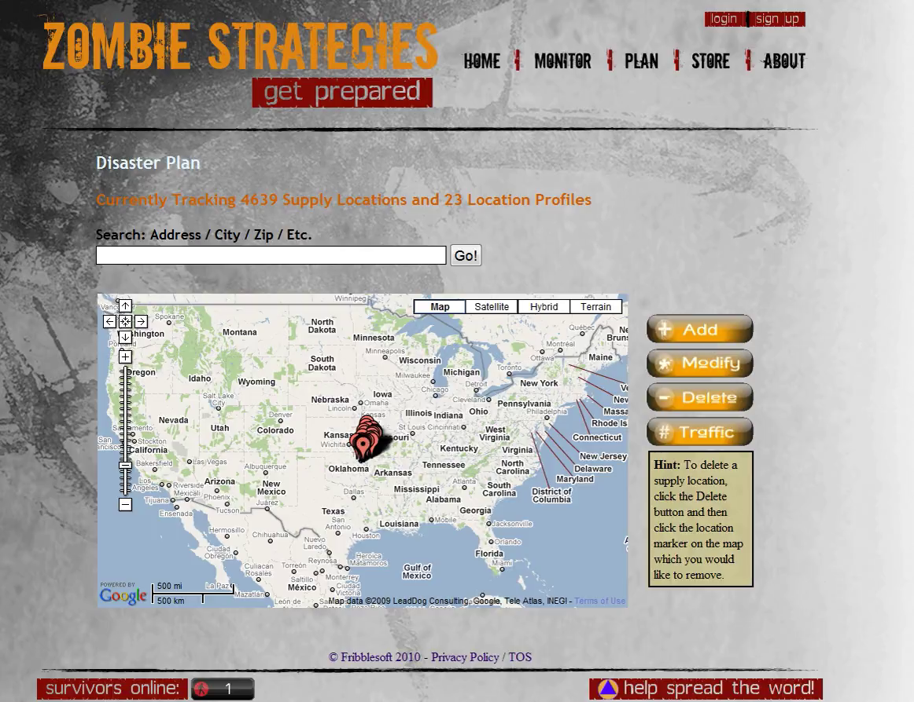

Zombie Strategies
=================

The source code for the original zombiestrategies.com website

# Overview

ZombieStrategies.com was a website where anyone could add, modify, or delete emergency supply locations (in case of zombie apocalypse) along with a categorized list of supplies at each location.  The locations database was seeded with firearm dealers, gas stations, Walmarts, Targets, hospitals, hardware stores, and grocery stores.  Due to realistic life demands I am no longer able to maintain this project and so I am releasing the source code.

This project is the result of a personal programming ambition and several years of scope creep.

